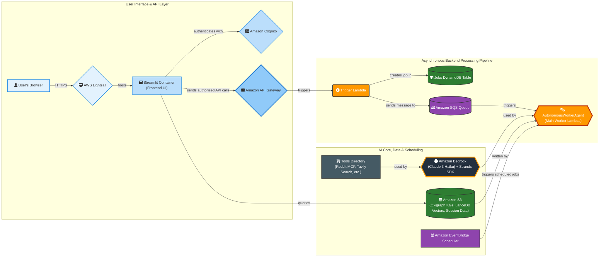

# MadSift: Misinformation Detection & Analysis Framework

MadSift is an autonomous AI agent framework built on AWS to combat the "infodemic" by proactively identifying, analyzing, and verifying emerging rumours from social media.

The system combines neuro-symbolic reasoning with knowledge graph construction to automatically discover, analyze, and verify claims, providing users with evidence-based insights through an interactive chat interface. It is a proactive intelligence platform designed to bring clarity and structure to the chaos of online information.

## Key Features

-   **Autonomous Scheduled Monitoring**: Task the agent to monitor a topic for a set duration (e.g., 7 days), automatically fetching data, building incremental Knowledge Graphs, and summarizing trends at set intervals—all without human intervention.
-   **Optimized, Serverless Graph Architecture**: A powerful combination of **Oxigraph** for high-performance RDF graph processing and **LanceDB** for vector storage, with both data artifacts persisted directly in Amazon S3.
-   **High-Performance Batch Processing**: A state-of-the-art pipeline for claim extraction and verification that achieves a **32x speedup** and **92% cost reduction** compared to sequential methods.
-   **Asynchronous & Scalable by Default**: Built on an event-driven pattern (API Gateway -> SQS -> Lambda) to ensure long-running, complex AI tasks are handled robustly without timeouts.
-   **Production-Ready Agent Runtime with Bedrock AgentCore**: Our core `AutonomousWorkerAgent` is built on Amazon Bedrock AgentCore. This containerized runtime is essential, allowing us to overcome standard Lambda limitations by supporting large AI dependencies (like LanceDB and PyArrow) and enabling **long-running processes of up to 15 minutes**. By leveraging a managed runtime, we can focus on building sophisticated agentic logic instead of low-level infrastructure.
-   **Interactive Graph-RAG Interface**: A Streamlit UI allows users to chat with the generated Knowledge Graphs, using both structured SPARQL queries and semantic vector search to get answers.

## Architecture

MadSift is architected as a robust, entirely serverless AWS application. The architecture decouples the user interface (hosted on AWS Lightsail) from the heavy asynchronous backend processing.

<details>
<summary>Click to view Architecture Diagram</summary>


</details>

## Technology Stack

| Category          | Technology / Service                                     |
| ----------------- | -------------------------------------------------------- |
| **AI & Agents**   | Amazon Bedrock, AWS Strands, Bedrock AgentCore           |
| **Compute**       | AWS Lambda (Container-based), AWS Lightsail              |
| **Integration**   | Amazon API Gateway, Amazon SQS, Amazon EventBridge       |
| **Storage**       | Amazon S3, Amazon DynamoDB                               |
| **Data & Graphs** | Oxigraph (RDF), LanceDB (Vectors)                        |
| **Authentication**| Amazon Cognito                                           |
| **Deployment**    | AWS SAM, Docker, Amazon ECR                              |

## Key Integrations

-   **Smithery (Model Context Protocol)**: For social media data acquisition, we use the Model Context Protocol (MCP) via a Smithery server. This provides a flexible, stateful connection for our agent to stream and analyze live conversations from sources like Reddit, moving beyond traditional REST APIs.
-   **Tavily Search API**: For high-performance evidence retrieval, we use Tavily. As an AI-native search API, it provides clean, RAG-optimized content and advanced parameters (like date filters) that give our verification agent the precision of a skilled researcher.

## Prerequisites

Before deploying, ensure you have the following installed and configured:
-   [AWS CLI](https://aws.amazon.com/cli/) (configured with your credentials)
-   [AWS SAM CLI](https://docs.aws.amazon.com/serverless-application-model/latest/developerguide/serverless-sam-cli-install.html)
-   [Docker](https://www.docker.com/products/docker-desktop/)

## Configuration

### 1. API Keys in AWS Secrets Manager

Before deploying, you must create secrets in AWS Secrets Manager (in the `us-east-1` region) to store your third-party API keys. Our code retrieves these at runtime.

-   **Tavily API Key**:
    -   Secret Name: `api_secret`
    -   Secret Key: `tavily`
    -   Secret Value: `<YOUR_TAVILY_API_KEY>`
-   **Smithery API Key**:
    -   Secret Name: `api_secret`
    -   Secret Key: `smithery`
    -   Secret Value: `<YOUR_SMITHERY_MCP_API_KEY>`

### 2. Cognito Configuration

The SAM template requires your existing Amazon Cognito User Pool details. Open `template.yaml` and update the `Parameters` section with your values:

```yaml
Parameters:
  CognitoUserPoolId:
    Type: String
    Default: "<YOUR_COGNITO_USER_POOL_ID>" # e.g., us-east-1_xxxxxxxxx
    Description: Cognito User Pool ID

  CognitoAppClientId:
    Type: String
    Default: "<YOUR_COGNITO_APP_CLIENT_ID>" # e.g., 2qnmhh7vjc15baqiio0p3t95tn
    Description: Cognito App Client ID
```

## Deployment

Deployment is a two-step process: first the serverless backend, then the Streamlit frontend.

### 1. Backend Deployment (AWS SAM)

The entire backend infrastructure (Lambda, SQS, DynamoDB, etc.) is managed by the AWS Serverless Application Model (SAM).

**Step 1: Build the Lambda Container Images**
This command builds the Docker images for all Lambda functions defined in the `template.yaml`.
```bash
sam build
```

**Step 2: Deploy the Stack**
This command will package and deploy the application to AWS. The `--guided` flag will prompt you for parameters the first time and save them to a `samconfig.toml` file for future deployments.
```bash
sam deploy --guided
```
After deployment, SAM will output the `ApiGatewayUrl`. You will need this for the frontend deployment.

### 2. Frontend Deployment (AWS Lightsail)

The Streamlit user interface is deployed as a container to AWS Lightsail using the provided script.

**Step 1: Configure the Deployment Script**
Open the `lightsail_deploy.sh` script and ensure the configuration variables at the top match your environment:
```bash
# The name of your Lightsail Container Service
SERVICE_NAME="madsift-ui"

# The name of the CloudFormation stack from the SAM deployment
STACK_NAME="madsift-dev"
```

**Step 2: Make the Script Executable**
```bash
chmod +x lightsail_deploy.sh
```

**Step 3: Run the Deployment Script**
This script will automatically:
1.  Fetch the ECR repository and API Gateway URLs from your deployed SAM stack.
2.  Build and tag the Streamlit Docker image.
3.  Push the image to its ECR repository.
4.  Deploy the new image to your AWS Lightsail service, injecting the API Gateway URL as an environment variable.

```bash
./lightsail_deploy.sh
```
Once the script finishes, your Streamlit UI will be live and connected to your backend.

## License

This project is licensed under the MIT License.